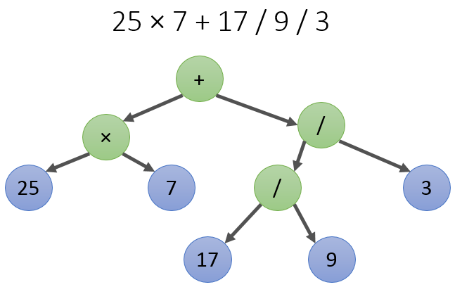

## An example of recursive descent for a calculator

An expression tree is something like this:


Links:

- https://ps-group.github.io/compilers/simple_recursive_parser.html
- https://en.wikipedia.org/wiki/Recursive_descent_parser
- http://www.craftinginterpreters.com
- https://rosettacode.org/wiki/Recursive_descent_parser_generator

## About program

This is an example of a simple console calculator implemented through a Recursive Descent Parser. All the usual operator
precedence and associativity rules were followed. The calculator supports basic arithmetic operations [+,-,*,/,^] and
parentheses.

Example:

```
>>> 2+2
Result: 4
>>> 5 - 100 + 4
Result: -91
>>> 2^(3+2)
Result: 32
>>> (1+2)/(10-7)
Result: 1
>>> 8-9-(1
Exception in thread "main" expression.ParseException:  ) not found.
```